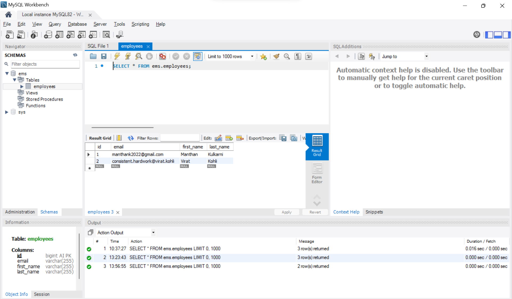

# Angular | Spring Boot | MySQL | Full Stack
## Employee Management System

## Angular Frontend 
https://github.com/ManthanK-24/Employee_Management_System_Angular/ 

## Architecture

## Create or Add Employee Data

## Get All Employees Data

## Get Employee By ID

## Update Employee Data

## Delete Employee By ID

## MySQL Database

