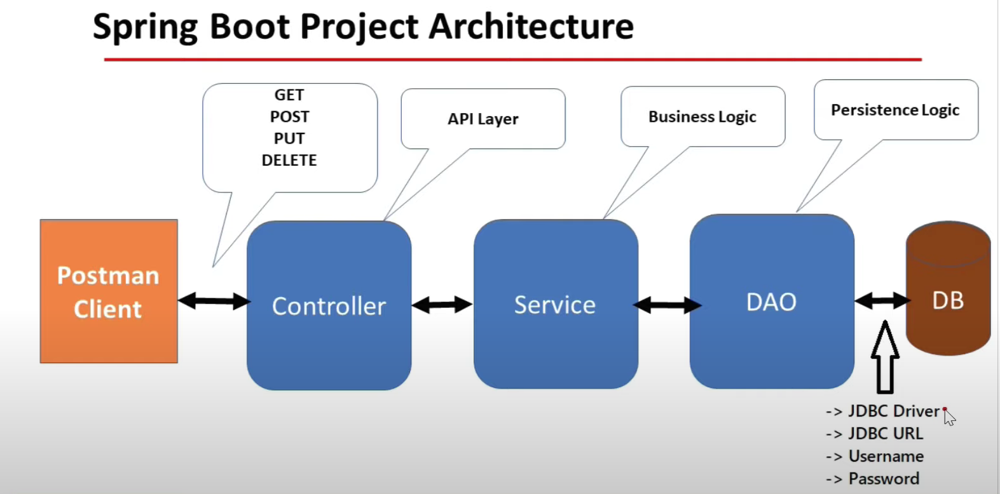
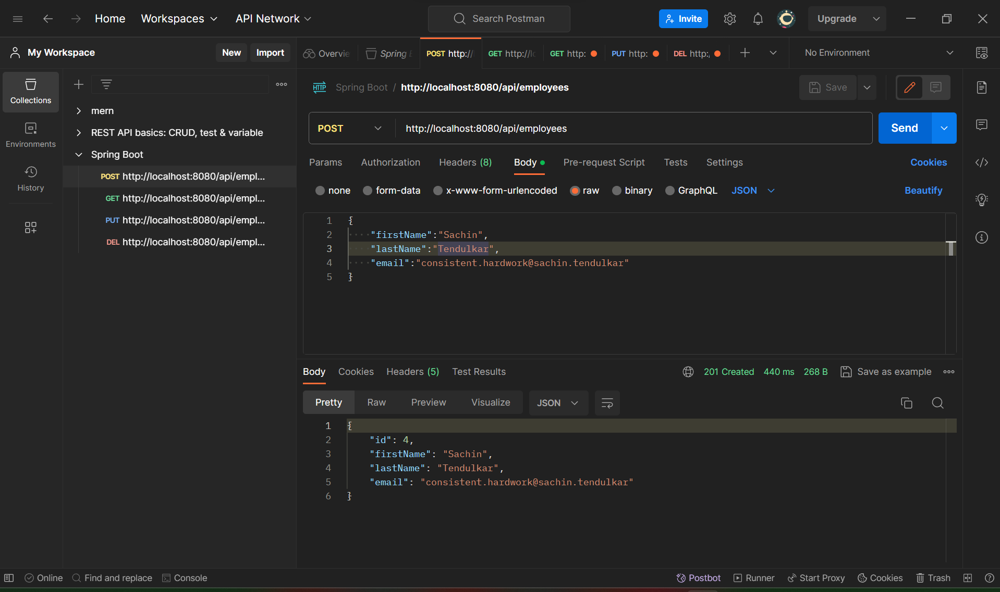
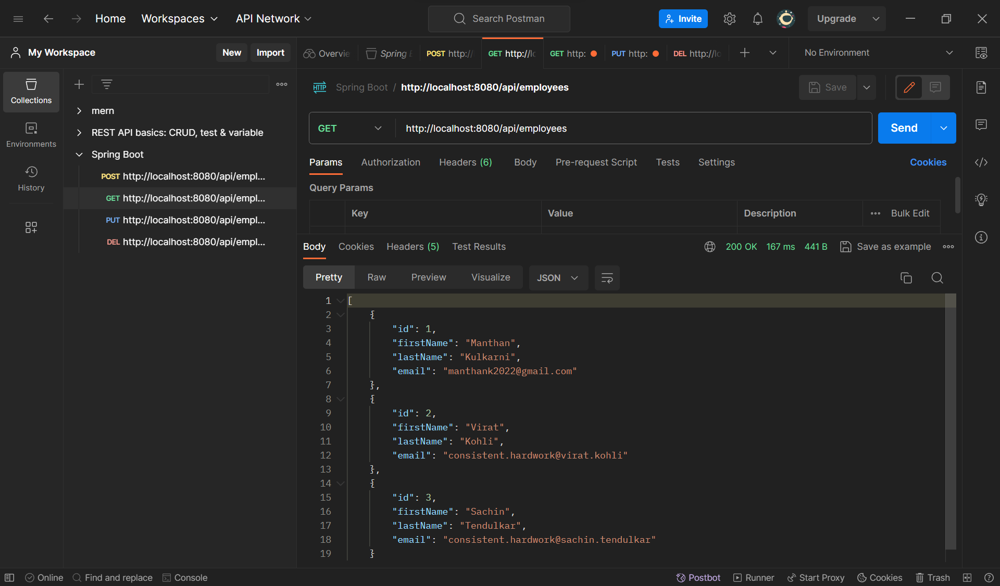
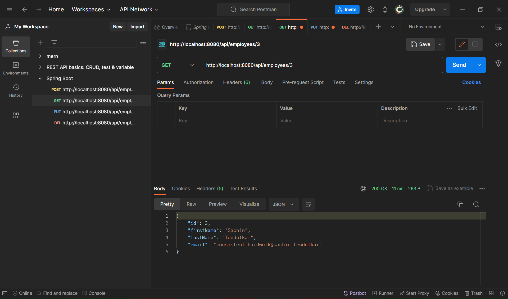
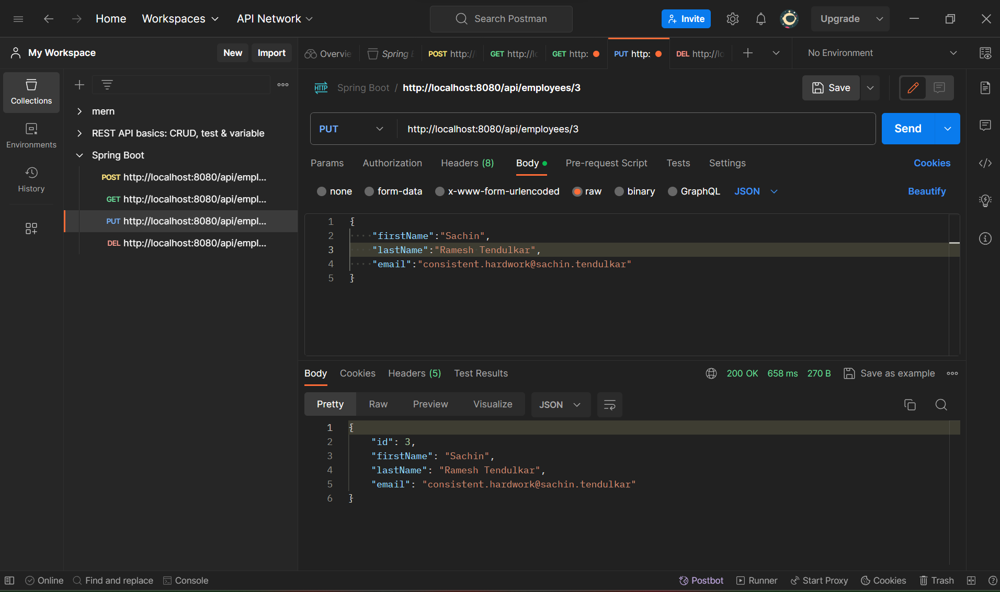
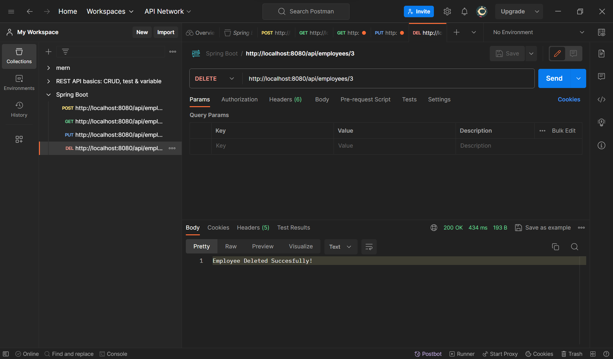

# Spring Boot CRUD Operations using REST APIs
## Employee Management System
## Architecture

## Create or Add Employee Data

## Get All Employees Data

## Get Employee By ID

## Update Employee Data

## Delete Employee By ID

